# system/attack

This package and its sub-packages implement all melee attack execution in Sword: Combat Evolved.
There are two distinct attack systems active in the codebase simultaneously:

- **Legacy sweep system** — `Attack`, `SweepAttack`, `ItemDisplayAttack`, etc. Drives time-sliced
  Bezier sweeps on the Bukkit main thread. Used by all current player combos and mob attacks.
- **Volume simulation system** — `def/`, `simulation/`, and associated classes in `Combatant`.
  Drives an off-thread 200 Hz OBB/capsule collision loop. Currently wired only to the dev wand.

---

## Package-level class inventory

| Class | Role |
|-------|------|
| `Attack` | Base class for all legacy sweep attacks. Drives a time-sliced Bezier iteration loop via `TimeArbiter`. Handles hit detection via `HitboxUtil.secant`, applies `HitValuePacket`, draws particles, checks ground collision, and chains to `nextAttack`. |
| `SweepAttack` | Extends `Attack`. All sweep display code is commented out — behaves identically to `Attack` today. Dead fields: `sweepDisplays`, `sweepTail`, `sweepBody`, `sweepFront`, `tpDuration`, etc. |
| `ItemDisplayAttack` | Extends `Attack`. Moves an existing `ItemDisplay` entity along the Bezier path. `displayOnly=true` skips hit detection (used for windup animations). |
| `UmbralBladeAttack` | Extends `ItemDisplayAttack`. Adds a 20-block distance guard to hit detection. Associates an `UmbralBlade` for state callbacks. |
| `MobSweepAttack` | Extends `SweepAttack`. Overrides `hit()` to apply `Prefab.Attacks.DEFAULT_MOB_HIT` instead of the default player packet. |
| `GeneratedAttackProfile` | Implements `AttackProfile` with runtime world-space `ControlVectors`. Wraps a world-space `BezierShape` — skips basis adjustment. Used for heavy sweeps targeting a specific entity. |
| `HitValuePacket` | Bundles all five damage values as `Supplier<T>` for hot-reload compatibility. Also carries `Blockability` and `bypassPower`. |
| `Blockability` | Enum: `BLOCKABLE` (fully negated by block/parry) or `SHIELD_PASSING` (scaled by `bypassPower`). |
| `ActiveAttack` | Record: game-layer view of an in-progress `AttackDef` attack. Holds the definition, owner UUID, start time, and shared `hitThisAttack` set. Lives on `Combatant`. |

## Sub-package summary

| Package | Purpose |
|---------|---------|
| `style/` | `AttackProfile` interface, `AttackShape` interface, `AttackType` enum, `WeaponAttackStyle` enum, and the three shape implementations (`BezierShape`, `ArcShape`, `ConeShape`). |
| `def/` | Immutable `AttackDef` data model, `AttackPrimitive` enum, `AttackDefSerializer` (YAML ↔ `AttackDef`), `AttackRegistry` (global static map). See `def/README.md`. |
| `simulation/` | Off-thread 200 Hz collision loop, volume primitives, trajectories, spatial grid, collision detection, thread-safe bridges. See `simulation/README.md`. |
| `dev/` | Dev-only tooling: recording, editing, visualizing, and testing volume attacks with a wand. See `dev/README.md`. |

---

## Dependency graph

```mermaid
graph TD
    subgraph External callers
        AC["AttackAction\n(action/attack/)"]
        DA["DashAttackAction\n(action/attack/)"]
        PA["PunchAction\n(action/attack/)"]
        UBS["UmbralBlade states\n(entity/umbral/statemachine/state/)"]
        Comb["Combatant\n(entity/impl/)"]
        SE["SwordEntity\n(entity/base/)"]
        PL["PlayerListener\n(listeners/)"]
        Sword["Sword.java"]
        IR["InputRegistrar\n(input/)"]
        Menus["dev menus\n(inventory/menu/dev/)"]
    end

    subgraph "system/attack (root)"
        Attack
        SweepAttack
        ItemDisplayAttack
        UmbralBladeAttack
        MobSweepAttack
        GeneratedAttackProfile
        HitValuePacket
        Blockability
        ActiveAttack
    end

    subgraph "system/attack/style"
        AttackProfile
        AttackShape
        AttackType
        WeaponAttackStyle
        BezierShape
        ArcShape
        ConeShape
    end

    subgraph "system/attack/def"
        AttackDef
        AttackPrimitive
        AttackDefSerializer
        AttackRegistry
    end

    subgraph "system/attack/simulation"
        VolumeSimulation
        SimulationAttack
        VolumeTrajectory
        KeyframedTrajectory
        SweepTrajectory
        Volume
        ObbVolume
        CapsuleVolume
        VolumeKeyframe
        VolumeShape
        SweepCurve
        SpatialGrid
        CollisionDetector
        CollisionEvent
        CollisionEventBridge
        EntitySnapshotMap
        EffectsDispatcher
        KeyframeEffect
        ParticleEffect
        SoundCue
    end

    subgraph "system/attack/dev"
        AttackDevSession
        DevMode
        AnimationMode
        AnimationModeInputHandler
        VolumeEditorMode
        WandActions
        SweepRecordingAction
        SaveConfirmDialog
        RecordedSample
    end

    %% Legacy sweep path
    AC --> SweepAttack
    AC --> AttackType
    AC --> WeaponAttackStyle
    DA --> Attack
    UBS --> ItemDisplayAttack
    UBS --> UmbralBladeAttack
    UBS --> GeneratedAttackProfile
    Comb --> MobSweepAttack
    Attack --> AttackProfile
    Attack --> HitValuePacket
    SweepAttack --> Attack
    ItemDisplayAttack --> Attack
    UmbralBladeAttack --> ItemDisplayAttack
    MobSweepAttack --> SweepAttack
    GeneratedAttackProfile --> AttackProfile
    GeneratedAttackProfile --> BezierShape
    AttackType --> BezierShape
    WeaponAttackStyle --> AttackType

    %% Volume / def path
    AC -->|wand| AttackDef
    Sword -->|onEnable| AttackRegistry
    Sword -->|onEnable| VolumeSimulation
    Sword -->|onEnable| CollisionEventBridge
    Comb -->|launchAttackDef| AttackDef
    Comb -->|launchAttackDef| SimulationAttack
    Comb -->|launchAttackDef| VolumeSimulation
    Comb -->|launchAttackDef| ActiveAttack
    SE -->|onTick| EntitySnapshotMap
    AttackDef --> AttackPrimitive
    AttackDef --> VolumeTrajectory
    AttackPrimitive --> ObbVolume
    AttackPrimitive --> CapsuleVolume
    VolumeSimulation --> SimulationAttack
    VolumeSimulation --> SpatialGrid
    VolumeSimulation --> CollisionDetector
    VolumeSimulation --> CollisionEventBridge
    VolumeSimulation --> EntitySnapshotMap
    VolumeSimulation --> EffectsDispatcher
    KeyframedTrajectory --> VolumeKeyframe
    KeyframedTrajectory --> VolumeShape
    SweepTrajectory --> SweepCurve
    CollisionEventBridge -->|drainToMain| SE

    %% Dev path
    IR --> WandActions
    IR --> SweepRecordingAction
    PL -->|PlayerMoveEvent| AttackDevSession
    Menus --> AttackDevSession
    AC -->|wand| AttackDevSession
    AC -->|wand| VolumeEditorMode
    AttackDevSession --> DevMode
    AttackDevSession --> VolumeEditorMode
    AnimationMode --> AttackDevSession
    AnimationModeInputHandler --> AttackDevSession
    SaveConfirmDialog --> AttackDef
    SaveConfirmDialog --> AttackDefSerializer
    SaveConfirmDialog --> AttackRegistry
    SweepRecordingAction --> AttackDef
    SweepRecordingAction --> AttackDefSerializer
    SweepRecordingAction --> AttackRegistry
    VolumeEditorMode --> VolumeKeyframe
    VolumeEditorMode --> VolumeShape
    VolumeEditorMode --> SimulationAttack
    WandActions --> AttackDevSession
```

---

## How a legacy sweep attack works

1. An `AttackAction` (or blade state) constructs a `SweepAttack`/`ItemDisplayAttack`/`UmbralBladeAttack`
   and calls `execute(combatant)`.
2. `execute()` stores the attacker, builds the entity filter, and calls `cast()`.
3. `cast()` calls `applyAttackCooldown()`, resolves optional duration scaling, then calls `startAttack()`.
4. `startAttack()` captures the attacker's `Basis`, calls `attackProfile.shape().resolve(basis, range)`
   to produce a `Function<Double, Vector>` path function, and starts a repeating `TimeArbiter` task.
5. Each task tick advances `t`, computes `cur`, draws particles (`drawAttackEffects`), performs hit
   detection (`performHitLogic` → `collectHitEntities` → `HitboxUtil.secant`), and checks ground
   collision (`swingTest`).
6. Each new entity hit calls `hit()` which invokes `SwordEntity.hit(attacker, packet, knockback)`.
7. When `curIteration >= attackIterations`, the task ends, the callback fires, and a chained
   `nextAttack` (if any) is scheduled.

## How a volume attack works

1. `Combatant.launchAttackDef(def)` is called (from `AttackAction.fireWandDef` or directly).
2. A shared `hitThisAttack` set is created. An `ActiveAttack` record is stored on `Combatant`.
3. A `SimulationAttack` is built with locked-origin capture if needed and handed to
   `VolumeSimulation.addAttack()`.
4. The 200 Hz simulation thread evaluates `VolumeTrajectory.sample(t, worldTransform, volume)` each
   tick, inserts the volume AABB into `SpatialGrid`, then tests all entity snapshots from
   `EntitySnapshotMap` via `Volume.intersects()`.
5. Hits post `CollisionEvent` to `CollisionEventBridge`. The main thread drains this queue each tick
   and resolves damage.
6. At `t=1.0`, the attack expires; the `onEnd` callback clears `Combatant.currentAttack`.

## Extension points

**Legacy system:**
- New named curve: add an entry to `AttackType` with a `ControlVectors`.
- New weapon category: add an entry to `WeaponAttackStyle`.
- New shape type: implement `AttackShape`.
- AOE / sphere: extend `Attack`, override `collectHitEntities()`.

**Volume system:**
- New attack: build an `AttackDef` with the builder and register it, or create a YAML file in
  `plugins/sword/attacks/`.
- New volume shape: add a `Volume` subclass, a `VolumeTrajectory` implementation, and an
  `AttackPrimitive` enum entry. See `simulation/README.md`.

---

## Known issues (root package)

**`SweepAttack` is dead weight today.**
All display logic is commented out. Every field (`sweepDisplays`, `sweepTail`, `sweepBody`,
`sweepFront`, `tpDuration`, `xScale`, `yScale`, `zScale`, `tail`, `front`, `dynamicNormal`,
`displayRollRotation`, `iterationsBetweenDisplaySpawn`) is dead. `SweepAttack` is functionally
identical to `Attack`. Consider removing these fields and deferring the display feature until a
concrete implementation is ready, or deleting `SweepAttack` and using `Attack` directly.
(`SweepAttack:20–38`, all overrides are no-ops or empty)

**`UmbralBladeAttack.drawAttackEffects()` is a pass-through override.**
It calls `super.drawAttackEffects()` and does nothing else. The override exists only to mark
intent but adds no behaviour. It can be removed. (`UmbralBladeAttack:45–47`)

**Distance check in `UmbralBladeAttack.collectHitEntities` is squared incorrectly.**
The condition `entity.getLocation().distanceSquared(attackLocation) < 20` compares
distance-squared against 20, which is a radius of ~4.5 blocks — not 20 blocks as documented.
The check probably intends `< 400` (20 blocks squared). (`UmbralBladeAttack:58`)

**`ActiveAttack` exists but has no unique responsibilities today.**
`Combatant.launchAttackDef` creates an `ActiveAttack` record and stores it in `currentAttack`,
but only reads it in the debug log in `onAttackEnd()` and to clear it. The `hitThisAttack` set
is shared directly with `SimulationAttack` — `ActiveAttack` is redundant middle layer. Consider
eliminating it and storing the fields directly on `Combatant`, or giving it a real role (e.g.,
exposing `def()` for external queries like `canInterruptAttack()`).

**`Attack.drawAttackEffects` hardcodes `Prefab.Particles.TEST_SWING`.**
Particle selection is not driven by the attack type or profile. TODO #128 tracks this.
(`Attack:386`)

**`Attack.hit()` hardcodes `Prefab.Attacks.BASIC_ATTACK`.**
The `HitValuePacket` on the `attackProfile` is never used in `Attack.hit()`. Subclasses
(`ItemDisplayAttack`, `MobSweepAttack`) each hardcode their own packet. A cleaner design would
pass the packet through `AttackProfile` or a constructor argument. (`Attack:416`)

**`ImpalingUmbralBladeAttack` no longer exists in the codebase.**
It is referenced in the previous README and in agent memory notes but has been removed. The previous
README entry for it should not be considered authoritative.
